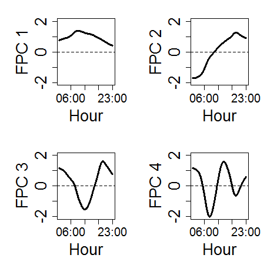
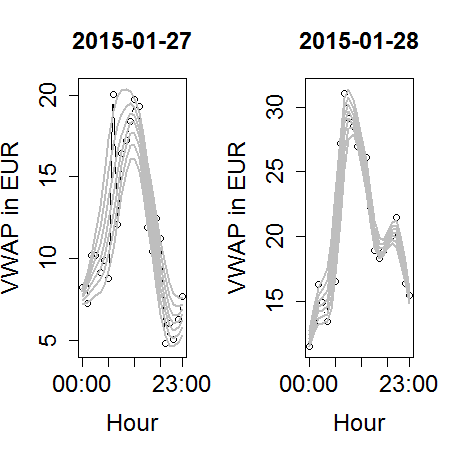
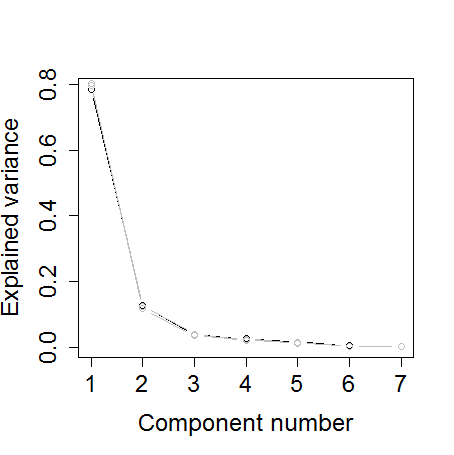
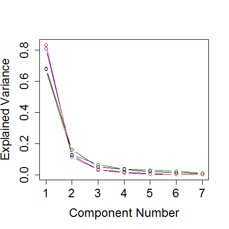
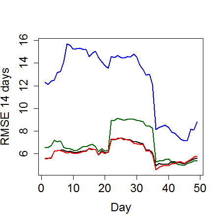

[](http://quantlet.de/)

## [](http://quantlet.de/) **VWAP_FPCA_Training** [](http://quantlet.de/)

```yaml

Name of QuantLet : VWAP_FPCA_Training

Published in : The behavior of electricity prices at the German intraday market

Description : 'Application of FPCA on the training data.  Fit VAR and Arima model on FPC scores.
Generate plots and tables with error measures, FPC explanatory power, FPC scores and FPC
eigenfunctions.'

Keywords : 'expectile, FPCA, Short-term energy price forecasting, VWAP, High-dimensional data
analysis, Functional time series, VAR, Arima, pca, factor scores'

See also : 'FASTECChinaTemper2008, FPCA_Electricity_Application, electricitypriceforecasting,
LQRCheck, VWAP_Forecast, VWAP_FPCA_Training, VWAP_FPCA_Forecast, VWAP_FASTEC_Forecast,
FPCA_Electricity_Simulation, FPCA_Electricity_Application, VWAP_Surfaceplot'

Author : Johannes Stoiber

Submitted : Sat, 22 April 2017 by Johannes Stoiber

Datafiles : VWAP.Rdata

```














### R Code:
```r
###############################################################################
##                                                                           ##
##       VWAP FPCA Training. R-Script to apply fpca to desaisonalized        ##
##       the vwap weries, and fit a VAR model on the fpca scores.            ##
##       Evaluation and plots after estimation procedure                     ##
##                                                                           ##
###############################################################################

# load the R Environment with prepared data and packages
load("VWAP.RData")
libraries = c("stargazer", "plyr","moments","zoo","forecast","urca","expectreg","fda.usc", "vars","lattice","tseries", "abind","sm","quantreg")
lapply(libraries,function(x)if(!(x %in% installed.packages())){install.packages(x)})
lapply(libraries,require,quietly=TRUE,character.only=TRUE)


###############################################################################
# set some prarameter
n             = 65                 # for 20 days | Train Data length
hour          = 24                 # number of avialable daily observations
tau           = c(0.01, 0.05, 0.25, 0.5, 0.75,  0.95, 0.99) # expectiles of interest
model         = "fourier"               # estimation of seasonal component
                                   # "fourier" includes also dummies for weekday and holidays
                                   # "no" only includes weekday and holidays
                                   # "smooth.spline", "sm.regression", "loess" do not include holiday and weekday effects
trsh          = .95                # threshold how mouch should be explained by exogenous variables; apply PCA
lag.l         = 3                  # (lag.l-1) determines allowed maximum lag length for VAR models.chose fiteen to allow for past two weeks as impact  
p             = 1                  # parameter demanded by for seasonality forecast
k             = 0                  # kk is used to set increasing steps, only needed to vary in testperiod
lt            = length(tau)        # number of expectils
exp.5         = which(tau %in% 0.5)# index of 0.5 expectile
exp.l         = which(tau %in% min(tau))
exp.u         = which(tau %in% max(tau))
holiday_dummy = holiday_dummy      # dummy variable indicating public holidays
###############################################################################


# input endogen
Input_list     = c(t(vwap[(1:n), ]))
# input exogen
Input_list_ex1 = c(t(spot[(1:n), ]))
Input_list_ex2 = c(t(con_act[(1:n), ]))
Input_list_ex3 = c(t(spv_act[(1:n), ]))
Input_list_ex4 = c(t(wnd_act[(1:n), ]))
Input_list_ex5 = c(t(con_for[(1:n), ]))
Input_list_ex6 = c(t(spv_for[(1:n), ]))
Input_list_ex7 = c(t(wnd_for[(1:n), ]))

# DSC: construct dummies for deseasonalization. wd and ph are only zeros
# because sun and wind do not care for weekend or public holidays
holiday_dummy = as.matrix(holiday_dummy, ncol = 1)
tempseq = as.numeric(rep(rep(c(1:7), each = 1), length.out = n + k + 2))
WD      = sapply(1:6, FUN = function(num){as.numeric(tempseq == num)})
wd      = matrix(rep(0, prod(dim(WD))), ncol = dim(WD)[2])
ph      = matrix(rep(0, (prod(dim(holiday_dummy)))))

# the seasonal component 
DSC_Fit         = matrix(dsc(Input_list, WD = WD, PH = holiday_dummy, n = n, k = k, hours = hour, p = p, model = model)[[2]], nrow = hour)

# compute desaisonalized series of prices
resid_data_yearly = matrix(dsc(Input_list, WD = WD, PH = holiday_dummy, n = n, k = k, hours = hour, p = p, model = model)[[1]], nrow = hour)
ex1_data_yearly   = matrix(dsc(Input_list_ex1, WD = WD, PH = holiday_dummy, n = n, k = k, hours = hour, p = p, model = model)[[1]], nrow = hour)

# actual residual load components
DSC_Input_ex2   = dsc(Input_list_ex2, WD = WD, PH = holiday_dummy, n = n, k = k, hours = hour, p = p, model = model)[[1]]
DSC_Input_ex3   = dsc(Input_list_ex3, WD = wd, PH = ph, n = n, k = k, hours = hour, p = p, model = model)[[1]]
DSC_Input_ex4   = dsc(Input_list_ex4, WD = wd, PH = ph, n = n, k = k, hours = hour, p = p, model = model)[[1]]
ex2_data_yearly = matrix(DSC_Input_ex2 - DSC_Input_ex3 - DSC_Input_ex4, nrow = hour)

## forecasted residual laod components
DSC_Input_ex5   = dsc(Input_list_ex5, WD = WD, PH = holiday_dummy, n = n, k = k, hours = hour, p = p, model = model)[[1]]
DSC_Input_ex6   = dsc(Input_list_ex6, WD = wd, PH = ph, n = n, k = k, hours = hour, p = p, model = model)[[1]]
DSC_Input_ex7   = dsc(Input_list_ex7, WD = wd, PH = ph, n = n, k = k, hours = hour, p = p, model = model)[[1]]
ex3_data_yearly = matrix(DSC_Input_ex5 - DSC_Input_ex6 - DSC_Input_ex7, nrow = hour)

# difference in residual load (actuals - forecast)
ex4_data_yearly = ex2_data_yearly - ex3_data_yearly

# compute Principal Components of the explanatory variables
PCA_ex  = list( pca.man(t(ex1_data_yearly), tau = trsh),
                pca.man(t(ex2_data_yearly), tau = trsh),
                pca.man(t(ex3_data_yearly), tau = trsh),
                pca.man(t(ex4_data_yearly), tau = trsh))


# get the scores:
scores.ex = lapply(PCA_ex, "[[", "scores" )

# set up for estimation procedure. xsim are the knots, mfit provides 3d array to store results from expectile sheet
xsim  = seq(1/nrow(resid_data_yearly), 1, length.out = nrow(resid_data_yearly)) 
mfit  = array(0, dim = c(ncol(resid_data_yearly), hour, lt)) # hour rows, traindata length cols, slices as length of tau

start = Sys.time() # compute time for duration

# Compute expectile sheet for every day
for (i in 1:n) {
  mfit[i, , ] = expectreg.ls(resid_data_yearly[, i] ~ rb(xsim, "pspline", center = FALSE),
                             estimate = "sheet", expectiles = tau, smooth = "gcv")$fitted
}
# 
time = Sys.time() - start; time

# the fitted values with the seasonal component
curve.FPCA = lapply(X = c(1:lt), FUN = function(X){t(mfit[c((lag.l + 1):n), , X]) + DSC_Fit[, c((lag.l + 1):n)]})


# mean function of estimated expectiles
for (i in 1:hour){
  if (i == 1){exp.mean = array(NA, dim=c(hour,lt))}
  for (j in 1:lt){
    exp.mean[i,j] = mean(mfit[,i,j] )
  }
}

# subtract mean series
center.mfit = sweep(mfit, 2:3, exp.mean)

# compute the funcitonal pc
result  = sapply(X = c(1:lt), FUN = fpca, fit = center.mfit, x = xsim, nh = 4)


# extract the scores for each expectile
scores  = result[3, ]


# assign names to scores
for (i in 1:length(scores)){
  colnames(scores[[i]]) = paste0("FPC", seq(1, 4))
}

# add a further element to the list containing nothing in order to estimate VAR/Arima without exogen variables
scores.ex[(length(scores.ex) + 1)] = list(NULL)


# fit an arima model to each expectile score series. chose by aic
fit_arima = lapply(X = c(1:lt), FUN = function(X){fit.auto.arima(end = scores, exo = scores.ex, expec = tau[X], tau = tau)})

# arima model fit for each tau level and each exogen and an endogen variable.
arima.spot = lapply(X = c(1:lt), fit.curve, fd = result, mean = exp.mean, model = lapply(fit_arima, "[[", 1), season = DSC_Fit, xsim = xsim, startperiod = 1)
arima.RLac = lapply(X = c(1:lt), fit.curve, fd = result, mean = exp.mean, model = lapply(fit_arima, "[[", 2), season = DSC_Fit, xsim = xsim, startperiod = 1)
arima.RLmk = lapply(X = c(1:lt), fit.curve, fd = result, mean = exp.mean, model = lapply(fit_arima, "[[", 3), season = DSC_Fit, xsim = xsim, startperiod = 1)
arima.RLdf = lapply(X = c(1:lt), fit.curve, fd = result, mean = exp.mean, model = lapply(fit_arima, "[[", 4), season = DSC_Fit, xsim = xsim, startperiod = 1)
arima.endo = lapply(X = c(1:lt), fit.curve, fd = result, mean = exp.mean, model = lapply(fit_arima, "[[", 5), season = DSC_Fit, xsim = xsim, startperiod = 1)


# estimate VAR models, select lag length with BIC and AIC
crit = c("SC", "AIC")

for (IC in crit){
  # estimate the models with VAR
  model.spot  = lapply(X = c(1:lt), FUN = function(X){VAR(y = scores[[X]], exogen = scores.ex[[1]], lag.max = (lag.l - 1), type = "const", ic = IC)}) 
  model.RLac  = lapply(X = c(1:lt), FUN = function(X){VAR(y = scores[[X]], exogen = scores.ex[[2]], lag.max = (lag.l - 1), type = "const", ic = IC)}) 
  model.RLmk  = lapply(X = c(1:lt), FUN = function(X){VAR(y = scores[[X]], exogen = scores.ex[[3]], lag.max = (lag.l - 1), type = "const", ic = IC)}) 
  model.RLdf  = lapply(X = c(1:lt), FUN = function(X){VAR(y = scores[[X]], exogen = scores.ex[[4]], lag.max = (lag.l - 1), type = "const", ic = IC)}) 
  model.endo  = lapply(X = c(1:lt), FUN = function(X){VAR(y = scores[[X]], exogen = scores.ex[[5]], lag.max = (lag.l - 1), type = "const", ic = IC)}) 
  
  fit.spot = lapply(model.spot, fitted)
  fit.RLac = lapply(model.RLac, fitted)
  fit.RLmk = lapply(model.RLmk, fitted)
  fit.RLdf = lapply(model.RLdf, fitted)
  fit.endo = lapply(model.endo, fitted)
  
  if (IC == "AIC"){
    VAR.spot.AIC   = lapply(X = c(1:lt), fit.curve, fd = result, mean = exp.mean, model = fit.spot, season = DSC_Fit, xsim = xsim, startperiod = lag.l)
    VAR.RLac.AIC   = lapply(X = c(1:lt), fit.curve, fd = result, mean = exp.mean, model = fit.RLac, season = DSC_Fit, xsim = xsim, startperiod = lag.l)
    VAR.RLmk.AIC   = lapply(X = c(1:lt), fit.curve, fd = result, mean = exp.mean, model = fit.RLmk, season = DSC_Fit, xsim = xsim, startperiod = lag.l)
    VAR.RLdf.AIC   = lapply(X = c(1:lt), fit.curve, fd = result, mean = exp.mean, model = fit.RLdf, season = DSC_Fit, xsim = xsim, startperiod = lag.l)
    VAR.endo.AIC   = lapply(X = c(1:lt), fit.curve, fd = result, mean = exp.mean, model = fit.endo, season = DSC_Fit, xsim = xsim, startperiod = lag.l)
  }
  if (IC == "SC"){
    VAR.spot.SC   = lapply(X = c(1:lt), fit.curve, fd = result, mean = exp.mean, model = fit.spot, season = DSC_Fit, xsim = xsim, startperiod = lag.l)
    VAR.RLac.SC   = lapply(X = c(1:lt), fit.curve, fd = result, mean = exp.mean, model = fit.RLac, season = DSC_Fit, xsim = xsim, startperiod = lag.l)
    VAR.RLmk.SC   = lapply(X = c(1:lt), fit.curve, fd = result, mean = exp.mean, model = fit.RLmk, season = DSC_Fit, xsim = xsim, startperiod = lag.l)
    VAR.RLdf.SC   = lapply(X = c(1:lt), fit.curve, fd = result, mean = exp.mean, model = fit.RLdf, season = DSC_Fit, xsim = xsim, startperiod = lag.l)
    VAR.endo.SC   = lapply(X = c(1:lt), fit.curve, fd = result, mean = exp.mean, model = fit.endo, season = DSC_Fit, xsim = xsim, startperiod = lag.l)
  }
}

# bind VAR information in one list
VAR_results   = list( "DA spot AIC"    = VAR.spot.AIC,
                      "RL actuals AIC" = VAR.RLac.AIC,
                      "RL MK AIC"      = VAR.RLmk.AIC,
                      "RL diff AIC"    = VAR.RLdf.AIC,
                      "VAR AIC"        = VAR.endo.AIC,
                      "DA spot SC"     = VAR.spot.SC,
                      "RL actuals SC"  = VAR.RLac.SC,
                      "RL MK SC"       = VAR.RLmk.SC,
                      "RL diff SC"     = VAR.RLdf.SC,
                      "VAR SC"         = VAR.endo.SC)

# arima shortened by first lag.l observations, to make results compareable with VAR
arima_results = list( "DA spot Arima"    = lapply(arima.spot, "[", TRUE, c((lag.l + 1):n)),
                      "RL acutals Arima" = lapply(arima.RLac, "[", TRUE, c((lag.l + 1):n)),
                      "RL MK Arima"      = lapply(arima.RLmk, "[", TRUE, c((lag.l + 1):n)),
                      "RL diff Arima"    = lapply(arima.RLdf, "[", TRUE, c((lag.l + 1):n)),
                      "Arima"            = lapply(arima.endo, "[", TRUE, c((lag.l + 1):n)))

###############################################################################
##                        Plots and Evaluation                               ##
##                                                                           ##
##       Part 1: Endogenous variable / FPCA                                  ##
##       Plot:   Mean function of expectiles                                 ##
##       Table:  Explained variance                                          ##
##       Plot:   Screeplot                                                   ##
##       Plot:   Eigenfunctions                                              ##
##       Plot:   Scores                                                      ##
##       Table:  Scores stationarity ADF + KPSS                              ##
##                                                                           ##
##       Part 2: Exogenous Variable / PCA                                    ##
##       Table:  Explained variance                                          ##
##       Plot:   Screeplot                                                   ##
##                                                                           ##
##       Part 3: Daily Curve plots                                           ##
##       Plot:   Stochastic component + expectiles                           ##
##       Plot:   Fitted Curves after FPCA + VAR procedure                    ##
##                                                                           ##
##       Part 4: Error evaluation                                            ##
##       Table:  RMSE Trainperiod                                            ##
##       Table:  Crossing of estimated expectile curves                      ##
##       Plot:   RMSE rolling window                                         ##
##                                                                           ##
###############################################################################

# Part 1: Endogenous variable / FPCA

# Plot of mean functions
plot(NA, ylim = c(range(exp.mean)), xlim = c(1,hour),
     main = expression(paste("Mean function ", mu(t))),
     ylab = "Expectile function",
     xlab = "Hour")
for (i in 1:7){lines(exp.mean[,i])}
dev.off()


# Table:  Explained variance 
var.mat = matrix(unlist(result[4, ]), ncol = lt, byrow = FALSE)
var.mat = rbind(var.mat, apply(var.mat, 2, sum))
rownames(var.mat) = c("FPC1", "FPC2", "FPC3", "FPC4", "Sum")
colnames(var.mat) = as.character(tau)
stargazer(var.mat, type = "text")

# Plot: Screeplot
result.scree  = (sapply(X = c(1:length(tau)), FUN = fpca, fit = mfit, x = xsim, nh = 7))[4, ]
plot(result.scree[[exp.5]], type = "b", #main = "Screeplot FPCA Expectiles",
     cex.lab = 1.5, cex.axis = 1.5, cex.main = 1.5,
     xlab = "Component number", ylab = "Explained variance")
# lower and upper expectile 
lines(result.scree[[exp.l]], type = "b", col = "grey")
lines(result.scree[[exp.u]], type = "b", col = "grey")
dev.off()


# Plot: Eigenfunctions
par(mar=c(5.2, 6.1, 2, 2)) 
par(mfrow = c(2, 2))
sapply(1:4, plot.PC, num = exp.5, result = result)
dev.off()

# Plot: Scores 
par(mar=c(5.2, 6.1, 2, 0.5)) 
par(mfrow = c(4, 1))
sapply(1:4, plot.score, num = exp.5, result = result)
dev.off()

# Table: Scores stationarity ADF + KPSS
stat.test = lapply(result[3, ], FUN = stationarity.test)
names(stat.test) = paste(as.character(tau), "expectile") 
ADF = sapply(stat.test, "[", 1, TRUE)
KPSS = sapply(stat.test, "[", 2, TRUE)
stargazer(ADF, type = "text")
stargazer(KPSS, type = "text")


# Part 2: Exogenous Variable / PCA
# Table:  Explained variance
## if one wants to see cumulated variance proportion, change "expl" to "cum.prop"
var.ext = (sapply(PCA_ex, "[[", "expl" ))[1:7, ]
ext.mat =  rbind(var.ext, apply(var.ext, 2, sum))
rownames(ext.mat) = c("PC1", "PC2", "PC3", "PC4", "PC5", "PC6","PC7", "Sum")
colnames(ext.mat) = c("DA Spot", "RL act", "RL MK", "RL diff")
stargazer(ext.mat, type="text")  

# PCA: Screeplot
plot(var.ext[, 1], type= "b", ylim = range(var.ext), #main = "Screeplot Exogenous Variables",
     xlab = "Component Number", ylab = "Explained Variance", cex.main = 1.5, cex.lab = 1.5, cex.axis = 1.5)
cols = c("blue", "red", "darkgreen")
for(var in 2:4){lines(var.ext[, var], col = cols[var-1], type = "b")}
# black is da spot, blue is rel act, red is rel mk0, green is rel diff
dev.off()


# Part 3: Daily Curve plots
# Plot: Stochastic component + expectiles two days in one plot
par(mfrow = c(1,2), cex.lab = 1.5, cex.axis= 1.5, cex.main = 1.5 )
for(a in 21:22){ 
  plot(c(t(vwap[a, ] - DSC_Fit[, a])),
       type = "b",
       ylim = range( cbind( c(vwap[a, ] - DSC_Fit[, a]), mfit[a, , ])),
       ylab = "VWAP in EUR",
       main = paste(rownames(vwap)[a]),
       xaxt = "n",
       xlab = "Hour")
  for (j in 1:lt){
    lines(mfit[a, , j], col = "grey", lwd = 2)
  }
  # hour at 1 equals "00:00 - 01:00"...
  axis(1, c(1, 7, 13, 19, 24), c("00:00", "06:00", "12:00", "18:00", "23:00"), cex.axis = 1.5)
}
dev.off()


# Plot: Fitted Curves after FPCA + VAR procedure two days in one plot
par(mfrow = c(1,2),cex.lab = 1.2, cex.axis= 1.2, cex.main = 1.2 )
for(a in 23:24){
  i = (a - lag.l); l = 1 # select model with l, 1 is for da spot as exogenous, lag selection with aic
  # organzize the data
  plot.data = array(NA, dim = c(hour, (3 + lt)))
  plot.data[, c(1:3)] = cbind( c(t(vwap[a, ])),  c(t(spot[a, ])),  DSC_Fit[, a])
  for (j in c(1:lt) ) {
    plot.data[, (j + 3)] = VAR_results[[l]][[j]][, i]
  }
  # plot the data.
  plot(plot.data[, 1], type = "l", col = "red",
       lty = 6,
       ylim = c(20,75), #range(plot.data),
       main = rownames(vwap)[a],
       xaxt = "n",
       xlab = "Hour",
       ylab = "EUR",
       cex.axis = 1.5,
       cex.lab = 1.5, 
       cex.main = 1.5,
       lwd = 2)
  lines(plot.data[, 2], lwd = 2, col = "darkgreen")
  lines(plot.data[, 3], lwd = 2, col = "blue")
  for (j in 1:lt){
    col.exp = ifelse(j == exp.5, "black", "grey")
    lines(plot.data[, (j + 3)], lwd = 2, col = col.exp)
  }
  axis(1, c(1, 7, 13, 19, 24), c("00:00", "06:00", "12:00", "18:00", "23:00"), cex.axis = 1.2)
}
dev.off()


# Part 4: Error evaluation:
# Table:  RMSE
origin = t(vwap[(lag.l + 1):n, ])
# Organize all VAR and arima 50% expectile estimates in a list
bind.50 = append(append(lapply(VAR_results, "[[", exp.5),
                        lapply(arima_results, "[[", exp.5)),
                        list(curve.FPCA[[exp.5]], t(spot[c((lag.l + 1):n), ]), DSC_Fit[, c((lag.l + 1):n) ] ))

# compute error measures for all
error.insample = t(sapply(X=c(1:length(bind.50)), fit.eval, origin = origin, model = bind.50))


# add information how often VWAP is within predicted tau range 
bind.models    = append(append(VAR_results, arima_results),list( curve.FPCA))
error.insample = cbind(error.insample,
                       "within_1%" = c(sapply(X = c(1:length(bind.models)), FUN = function(X){(hit.range(abind(bind.models[[X]], along = 3), origin, exp.l, exp.u))}),
                                        NA, NA),
                       "within_5%" = c(sapply(X = c(1:length(bind.models)), FUN = function(X){(hit.range(abind(bind.models[[X]], along = 3), origin, 2, 6))}),
                                        NA, NA),
                       "IER"       = c(sapply(X = c(1:length(bind.models)), FUN = function(X){(hit.range(abind(bind.models[[X]], along = 3), origin, 3, 5))}),
                                        NA, NA))

# model specifications
TS.model    = c(rep("VAR",10), rep("ARIMA",5), "Expectile Fit", "DA Spot", "Trend")
Exogen.info = c(rep(c("DA Spot", "RL actual", "RL forecast", "RL difference", " - "),3), rep(" - ", 3))
Lag.select  = c(rep("AIC",5), rep("BIC", 5), rep("AIC",5), rep(" - ", 3))

# combine information in df
error.insample = data.frame("TS model" = TS.model, "Selection" = Lag.select, "Exogenous Variable" = Exogen.info, error.insample)

# order by rmse
error.order    =  error.insample[order(unlist(error.insample[, 5]), -unlist(error.insample[, 6])), ]
stargazer(error.order, summary = FALSE, rownames = FALSE,type = "text")


# Plot: RMSE rolling window 
# length of interest
r.length = 14
RMSE.window = sapply(list("DA spot AIC" = VAR_results[[1]][[exp.5]], "DA spot SC" = VAR_results[[6]][[exp.5]],
                          "DA spot ARIMA" = arima_results[[1]][[exp.5]],
                          "Trend" = DSC_Fit[, (lag.l + 1):n], "DA spot" = t(spot[(lag.l + 1):n, ])),
                     rollingRMSE, r.length = r.length, origin = t(vwap[(lag.l + 1):n, ]))

plot(RMSE.window[, 1], type = "l", cex.lab = 1.5, cex.axis =1.5,
     ylim=range(RMSE.window),
     #main="RMSE over 93 days",
    # xaxt = "n",
     xlab = "Day",
     ylab = paste("RMSE",r.length,"days"),
     lwd = 2)
lines(RMSE.window[, 4], col = "blue", lwd = 2)      # seasonal trend
lines(RMSE.window[, 5], col = "darkgreen", lwd = 2) # da spot
lines(RMSE.window[, 3], col = "red", lwd = 2)       # spot arima
dev.off()


```
